<!-- ================================================================================= -->
<!--                               SARAL PROJECT HEADER                                -->
<!-- ================================================================================= -->

<div align="center">

<picture>
  <source media="(prefers-color-scheme: dark)" srcset="screenshots/logo-dark.png">
  <source media="(prefers-color-scheme: light)" srcset="screenshots/logo-light.png">
  
</picture>

<br/>

<p align="center">
  <a href="https://readme-typing-svg.demolab.com?font=Fira+Code&weight=600&size=16&duration=2800&pause=1200&color=EA580C&center=true&vCenter=true&width=520&lines=SIH26130%3A+Unified+Industrial+Approvals+Portal;Streamlined+Application%2C+Record%2C+Approval+Link;Single-Window+Compliance+for+Maharashtra;Team+Hexagon+%E2%80%A2+Smart+India+Hackathon+2026">
    
  </a>
</p>

<!-- Badges tailored to the actual project colors and details -->
[](#)
[](#)
[](#)
[](https://opensource.org/licenses/MIT)

<br/>

[](#)
[](#)
[](#)
[](#)
[](#)
[](#)
[](#)
[](#)

</div>

---

<!-- ================================================================================= -->
<!--                               RESOURCE ACTION HUB                                 -->
<!-- ================================================================================= -->

## 🔗 Project Resources & Links

<table align="center" width="100%">
  <tr>
    <td align="center" width="25%">
      <a href="https://your-live-deployment-link.vercel.app">
        
      </a>
      <br/><b>Live Demonstration</b>
    </td>
    <td align="center" width="25%">
      <a href="https://drive.google.com/drive/folders/YOUR_DRIVE_FOLDER_ID?usp=sharing">
        
      </a>
      <br/><b>SIH PPT, SRS & Flowcharts</b>
    </td>
    <td align="center" width="25%">
      <a href="https://youtu.be/YOUR_DEMO_VIDEO_ID">
        
      </a>
      <br/><b>Recorded Video Demo</b>
    </td>
    <td align="center" width="25%">
      <a href="https://github.com/CoDerHarsh5180/SIH-Hexagon">
        
      </a>
      <br/><b>Repository</b>
    </td>
  </tr>
</table>

---

## 📌 Problem Statement & Context

* **Problem Statement ID**: `SIH26130`
* **Title**: *Efficiency in streamlining industrial approvals, compliance processes, and access to government support services*
* **Theme**: Miscellaneous | **Category**: Software
* **Team**: Hexagon (Team ID: `131088`)
* **Reference Portals**: [MAITRI Maharashtra](https://maitri.maharashtra.gov.in/) • [National Single Window System (NSWS)](https://www.nsws.gov.in/) • [DPIIT](https://eodb.dpiit.gov.in/)

### Real-World Challenge
Entrepreneurs and business founders in India must navigate complex, fragmented clearance procedures across **multiple separate government offices** (Pollution, Labor, Fire, Local Municipalities). Existing portals often act as static directories that redirect applicants back to disparate departmental websites, leading to:
* Repetitive document uploads for each license.
* Unmonitored procedural delays with no automated accountability.
* Lack of coordination between field inspection teams and applicants.
* Missed financial subsidies due to scattered policy information.

### The SARAL Solution
**SARAL (Streamlined Application, Record, Approval Link)** provides a single-window digital platform that coordinates applicants, local district authorities, and apex state administrators. It consolidates document storage, automated application routing, deadline-based auto-escalation, and scheme discovery into one unified system.

---

## 🏗️ Technical Approach & Architecture

The system implementation follows the three-tier operational workflow directly mapped from our architecture:

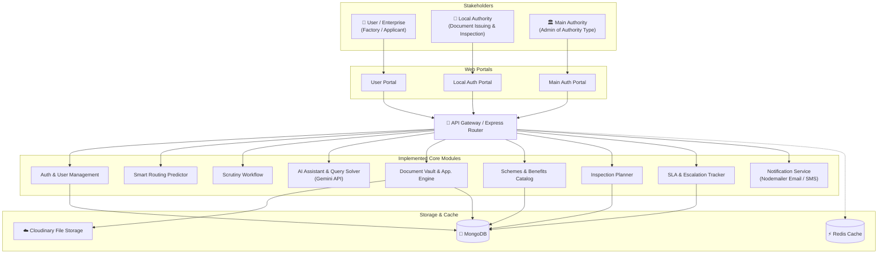

### System Roles & Responsibilities

1. **User / Enterprise**:
   * Enterprise or factory applicant applying for registrations, clearances, and expansions.
   * Uploads and reuses verified documents in a secure digital account (like DigiLocker).
   * Explores eligible subsidies, calculates incentives, and tracks clearance status.
2. **Local Authority**:
   * District-level officer responsible for reviewing submitted papers and issuing clearances.
   * Schedules on-site inspections and assigns visiting officers.
   * Approves documents with digital verification or requests necessary revisions.
3. **Main Authority**:
   * State-level departmental administrator overseeing overall clearance velocity.
   * Manages approval catalogs, publishes new government schemes and document requirements.
   * Reviews and addresses auto-escalated applications that breached local processing deadlines.

---

## ⚙️ Key Implemented Features

* **Know Your Approvals (KYA)**: An interactive questionnaire where users answer basic queries about their business type, land, and scale to get an exact checklist of required permits.
* **AI Document Intelligence**: Integrated with the **Gemini API** to pre-verify uploaded paperwork, detect missing fields, and flag inconsistencies before formal submission.
* **Doc + App Hub (Enterprise Vault)**: Secure document locker powered by **Cloudinary** and **MongoDB**, allowing users to upload once and reuse verified certificates across subsequent applications.
* **Document Tracking**: Real-time lifecycle visualizer showing current application stage, pending items, and assigned officers.
* **Smart Alerts & Escalation (SLA Monitoring)**:
  * Proactive alerts for upcoming document expiration and renewals.
  * Automated deadline tracking: applications pending beyond statutory timelines are flagged as `Escalated` and routed to the Main Authority.
* **Inspection Planner**: Local authorities schedule inspection dates and notify applicants with officer details.
* **Schemes & Incentive Calculator**: Accessible to public visitors and registered users to calculate eligible capital investment subsidies and stamp duty benefits.

---

## 🖥️ Platform Visual Walkthrough

The interface is presented below following the exact user journey: **Public Discovery (Pre-Auth)** ➔ **Authenticated Applicant Journey** ➔ **Local Authority Operations** ➔ **Main Authority Governance**.

---

### Phase 1: Public Discovery & Transparency (Accessible to Everyone)

#### 1. Landing Page
<div align="center">
  <picture>
    <source media="(prefers-color-scheme: dark)" srcset="screenshots/dark/landing_hero_dark.png">
    <source media="(prefers-color-scheme: light)" srcset="screenshots/light/landing_hero_light.png">
    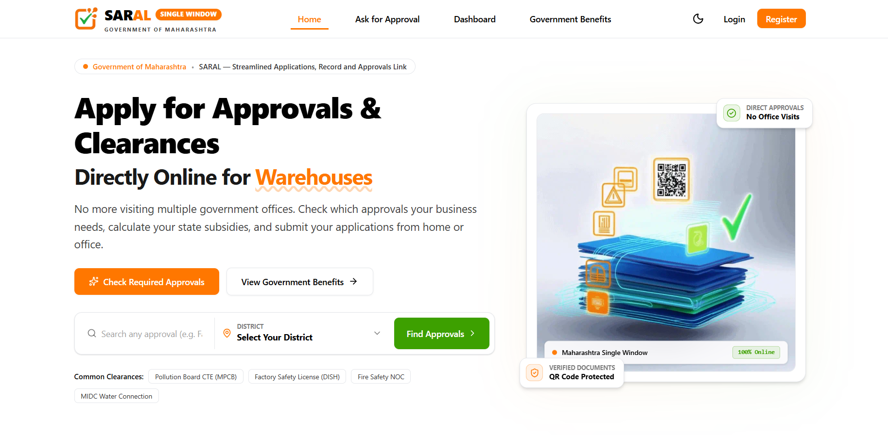
  </picture>
  <p><i>Landing portal with single-window overview and department navigation.</i></p>
</div>

#### 2. Public Transparency & Subsidy Calculator
<div align="center">
  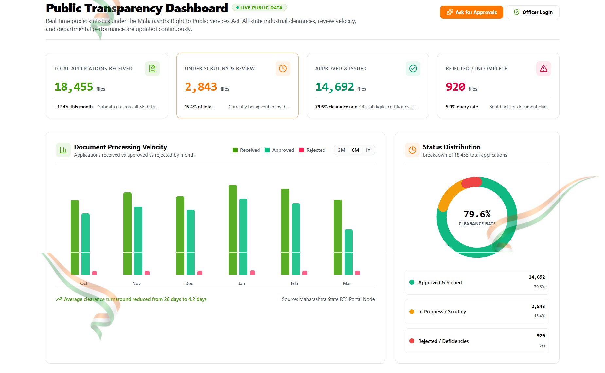
  <p><i><b>Public Transparency Dashboard:</b> Open governance statistics, clearance trends, and departmental metrics.</i></p>
</div>

<br/>

<div align="center">
  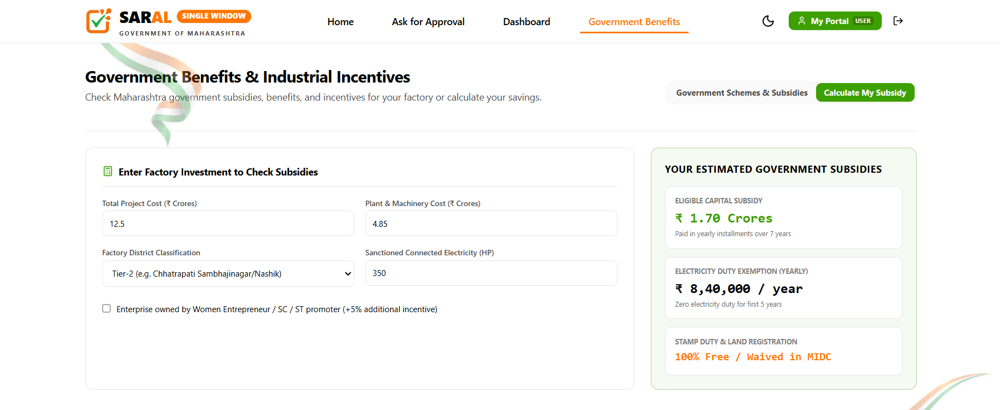
  <p><i><b>Government Subsidy & Incentive Calculator:</b> Instant calculation of eligible capital subsidies and exemptions.</i></p>
</div>

---

### Phase 2: Authenticated Entrepreneur / Applicant Journey

#### 3. Applicant Dashboard
<div align="center">
  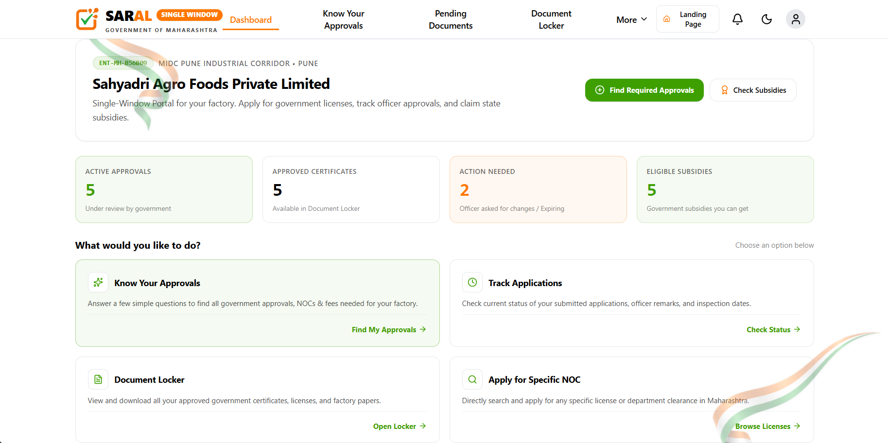
  <p><i><b>Applicant Dashboard:</b> Active clearances summary, application progress tracking, and pending actions.</i></p>
</div>

#### 4. Know Your Approvals (KYA) AI Assistant
<div align="center">
  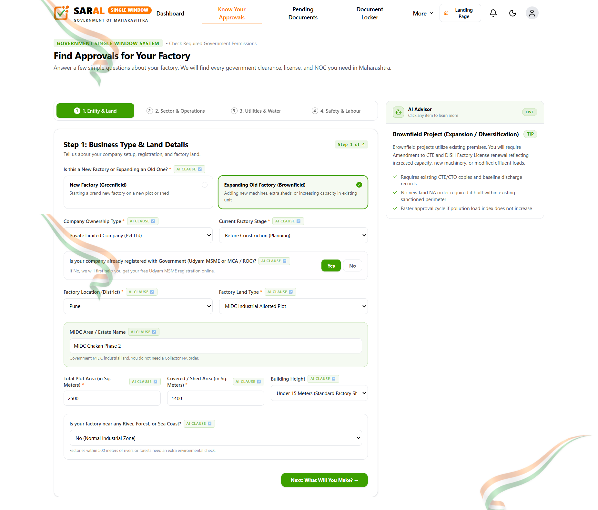
  <p><i><b>Know Your Approvals (AI-Assisted):</b> Step-by-step questionnaire generating the required clearance checklist based on business parameters.</i></p>
</div>

#### 5. Smart Document Vault
<div align="center">
  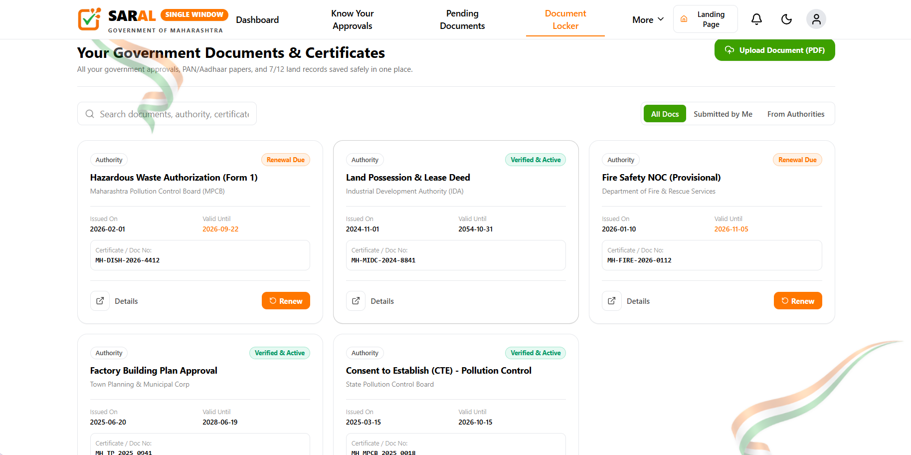
  <p><i><b>Smart Document Vault:</b> Centralized digital repository for verified certificates, renewal alerts, and reusable files.</i></p>
</div>

---

### Phase 3: Local District Authority Workflow

#### 6. Local Officer Review Queue
<div align="center">
  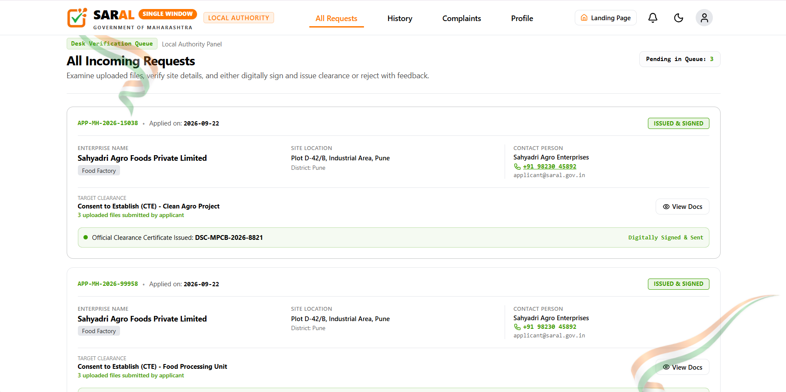
  <p><i><b>Local Officer Task Queue:</b> District-filtered application requests with AI verification indicators.</i></p>
</div>

#### 7. Site Inspection Scheduling
<div align="center">
  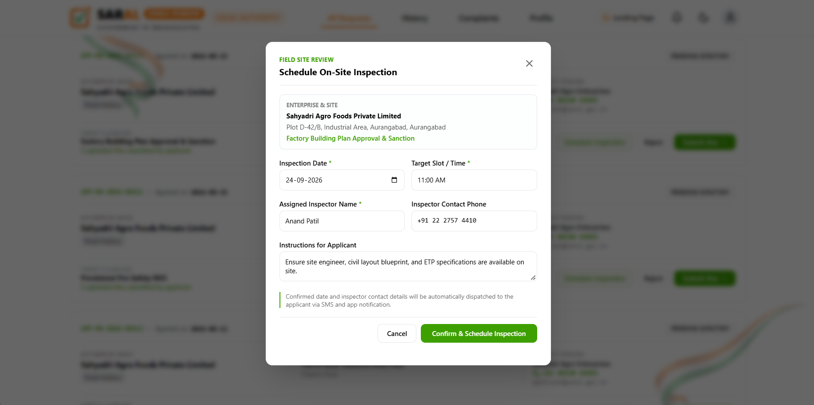
  <p><i><b>Inspection Planner:</b> Selecting field visit dates, assigning inspectors, and triggering applicant notification.</i></p>
</div>

---

### Phase 4: Main State Authority & SLA Governance

#### 8. State Authority Command Center & SLA Escalation Panel

<table width="100%">
  <tr>
    <td width="50%" align="center">
      <h4>🏛️ Main Authority Dashboard</h4>
      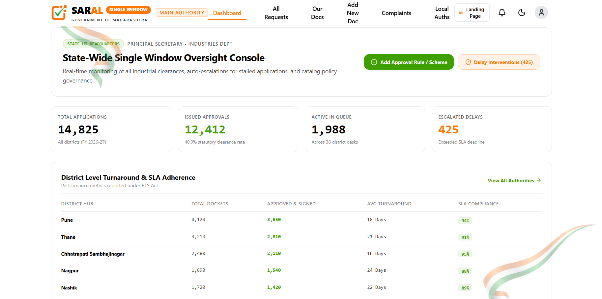
      <p><i>Macro clearance metrics, state-wide statistics, and policy catalog management.</i></p>
    </td>
    <td width="50%" align="center">
      <h4>⏱️ SLA Auto-Escalation Monitor</h4>
      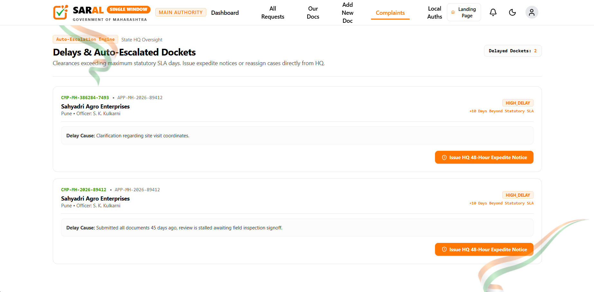
      <p><i>Applications stalled past statutory deadlines escalated to senior administrators.</i></p>
    </td>
  </tr>
</table>

---

## 🛠️ Technology Stack

Only the technologies actually utilized in the codebase and technical architecture:

<div align="center">

<a href="https://skillicons.dev">
  
</a>

<br/><br/>

| Component | Technology | Role in SARAL |
|---|---|---|
| **Frontend** | React, Vite | Dynamic single-page application for all 3 portals |
| **Styling** | Tailwind CSS | Modern, responsive interface design with theme support |
| **UI Components** | Lucide-React, Framer-Motion | Visual icons and smooth modal transitions |
| **Backend** | Node.js, Express | REST API routing, user authentication, and business logic |
| **Database** | MongoDB | Document database for applications, users, and scheme catalogs |
| **Caching** | Redis | Caching high-traffic catalog and public stats queries |
| **AI Integration** | Google Gemini API | Document verification and interactive KYA query solving |
| **File Storage** | Cloudinary | Cloud storage for uploaded PDFs and verified certificates |
| **Email Alerts** | Nodemailer | Automated notifications for inspections, approvals, and renewals |

</div>

---

## 🚀 Running the Project Locally

### Prerequisites
* **Node.js**: `v18+`
* **npm**: `v9+`
* **MongoDB**: Local instance or MongoDB Atlas URI

### 1. Clone the Repository
```bash
git clone https://github.com/CoDerHarsh5180/SIH-Hexagon.git
cd SIH-Hexagon
```

### 2. Backend Setup
```bash
cd backend
npm install
```

Create a `.env` file in the `backend/` directory:
```env
PORT=5000
MONGO_URI=your_mongodb_connection_string
JWT_SECRET=your_jwt_secret_key
CLIENT_URL=http://localhost:5173
GEMINI_API_KEY=your_gemini_api_key
CLOUDINARY_CLOUD_NAME=your_cloud_name
CLOUDINARY_API_KEY=your_api_key
CLOUDINARY_API_SECRET=your_api_secret
SMTP_HOST=smtp.gmail.com
SMTP_PORT=587
SMTP_USER=your_email@gmail.com
SMTP_PASS=your_email_app_password
```

Start the backend:
```bash
npm run dev
```

### 3. Frontend Setup
In a new terminal:
```bash
cd frontend
npm install
npm run dev
```
Open `http://localhost:5173` in your browser.

---

## 👥 Team Hexagon

**Smart India Hackathon 2026** | **Team ID: 131088**

| Member | Profile |
|---|---|
| **Harsh** | [@CoDerHarsh5180](https://github.com/CoDerHarsh5180) |
| **Ritika** | [@ritika-vishwa](https://github.com/ritika-vishwa) |
| **Yash** | [@yash-sharmaji](https://github.com/yash-sharmaji) |
| **Satyam** | [@Satyam-Sagar-25](https://github.com/Satyam-Sagar-25) |
| **Dheeraj** | [@Dheeraj7979](https://github.com/Dheeraj7979) |
| **Abhijeet** | [@abhijeetmishra15-codes](https://github.com/abhijeetmishra15-codes) |

---

## 📄 License & Acknowledgments

* Licensed under the **MIT License**.
* Developed for **Smart India Hackathon 2026** (Problem Statement `SIH26130`).
* Project reference guidelines from **Government of Maharashtra (MAITRI)** and **DPIIT**.

<div align="center">
  
</div>
